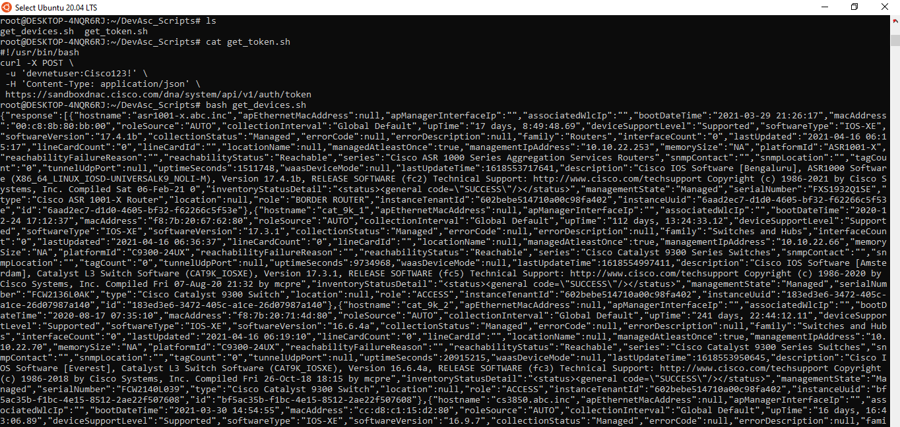
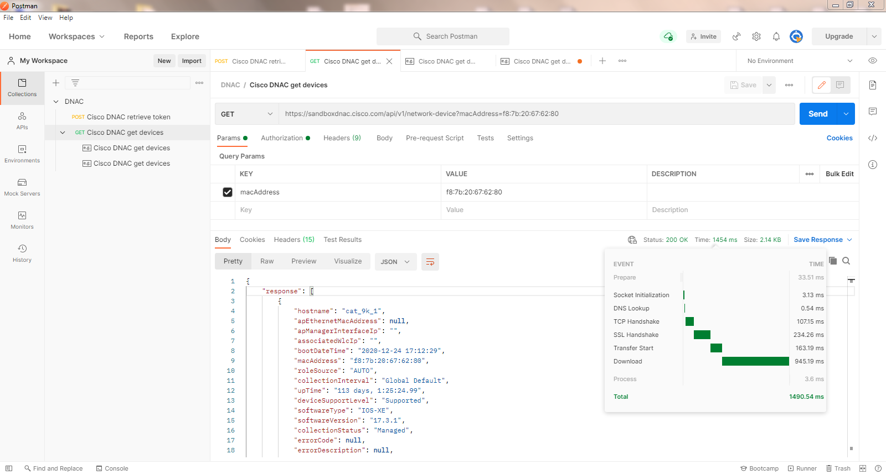
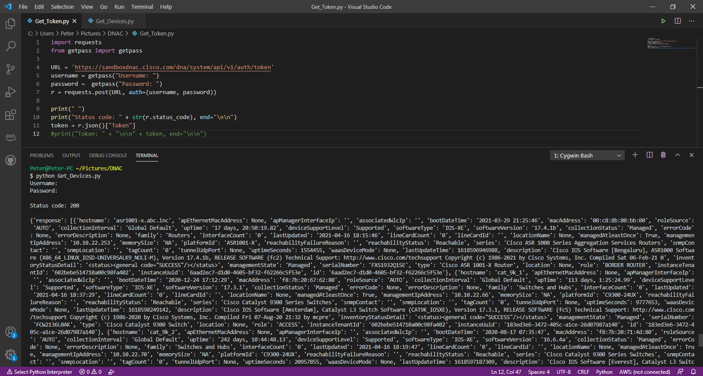

# APIs 

## Shell Script

* Run get_token.sh script
* Replace 'ENTER_TOKEN_HERE' with the token in the get_devices.sh
* Run get_devices.sh to get the list of devices managed by the DNAC

## Postman

## Python Script
